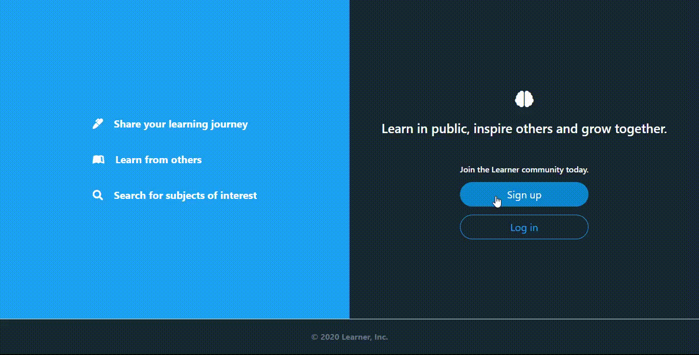

[](https://lbesson.mit-license.org/)
[](http://makeapullrequest.com)
[](https://github.com/ellerbrock/open-source-badges/)


# Learner

> Welcome to Learner!
A dedicated community for learners, with varying interests, to share their progress, connect with other learners and find inspiration on their journey to mastery!



## :tv: Media

[Live Demo Link](https://learnar.herokuapp.com/)

## MVP Features

[See wiki](https://github.com/cliftondavies/Learner/wiki)

## :toolbox: Tools & Technologies Used

### Built with

- HTML5
- CSS3
- SASS
- Bootstrap v4.5
- Ruby v2.6.5
- Ruby on Rails v5.2.4
- RSpec
- PostgreSQL >=9.5

## :rocket: Getting Started

To get a local copy up and running follow these simple example steps.

### Prerequisites

[Ruby](https://www.ruby-lang.org/en/documentation/installation/): 2.6.5

Rails: 5.2.3

```ruby
gem install rails -v 5.2.3
```

[PostgreSQL](https://www.postgresql.org/download/): >=9.5

### Setup

Clone repo into your local environment:

Clone with SSH

```git
git clone git@github.com:cliftondavies/Learner.git
```

Clone with HTTPS

```git
git clone https://github.com/cliftondavies/Learner.git
```

Open project directory

```bash
cd [your-directory-name]
```

Install gems:

```ruby
bundle install
```

Set up database:

```ruby
rails db:create
rails db:migrate
```

### Local Usage

#### In console

Start console:

```ruby
rails console
```

#### In Browser

Start server:

```ruby
rails server
```

Open `http://localhost:3000/` in your browser.

### Run tests

```ruby
rspec
```

### Deploy

```bash
heroku create
```
```bash
git push heroku master
```
```bash
heroku run rails db:migrate
```
```bash
heroku open
```

## Further Work

[See open issues](https://github.com/cliftondavies/Learner/issues)

## Author

👤 **Clifton Davies**

- Github: [@githubhandle](https://github.com/cliftondavies)
- Twitter: [@twitterhandle](https://twitter.com/cliftonaedavies)
- Linkedin: [linkedin](https://www.linkedin.com/in/clifton-davies-mbcs/)

## 🤝 Contributing

Contributions, issues and feature requests are welcome!

## Show your support

Give a ⭐️ if you like this project!

## Acknowledgments

- [Font Awesome Sass](https://github.com/FortAwesome/font-awesome-sass)
- [Gregoire Vella](https://www.behance.net/gregoirevella)
- [Tim Mossholder](https://unsplash.com/photos/WE_Kv_ZB1l0)

## 📝 Copyright & License

Copyright (c) 2020 Clifton Davies.
This project is licensed under [MIT](https://opensource.org/licenses/MIT). See LICENSE file for details.
